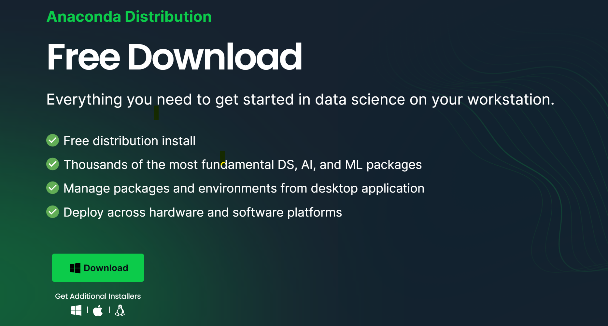

# Prelab 1

> Before Thursday 3/21 lab session (Week 1)
> 
> Yujia based on materials by Diane and Elizabeth

The goal is to install Jupyter Notebook and other important Python packages (e.g. Scipy, Numpy) for scientific computing.
If you already have Python and these packages installed, great. Otherwise, this guide will walk you through the installation. Please feel free to ping your TAs if you need any help.

We will use Python for all the computer labs. If you cannot resist to use your other favorite language you are welcome to do so, but keep in mind that the TAs may have limited experience with these languages in case you need help.

Here I will walk you through installing Anaconda, which is a suite of useful packages for scientific computing with Python. Try installing Anaconda and create a new Jupyter notebook before the first lab!

If you feel comfortable working in a terminal and want to make a customized coding environment instead, scroll down to find a guide for [miniconda](#miniconda).

## What is Jupyter notebook

Jupyter notebook is an interactive, web-based environment to run Python code.
You can arrange your code as cells, or "code chunks", and run them in any order you like.
This is drastically different from running a Python script where the computer has to read from the first line to the last.
This interactive way to run Python makes developing new code and debugging a breeze.

Jupyter comes with the additional benefit of allowing  [Markdown](https://www.markdownguide.org/basic-syntax/), i.e., explanatory chunks side-by-side with your code.
Once you get a hang, you will find it incredibly handy to run Python code, save the results, and comment on your method and results all in a single Jupyter notebook!

## Anaconda installation

Anaconda is your one-stop solution for scientific computing with Python as it includes Python itself, Jupyter, and other useful packages such as Scipy, Numpy, and Matplotlib.
Anaconda works across Windows, Mac and Linux operating system. To install click on this link
[https://www.anaconda.com/products/distribution](https://www.anaconda.com/products/distribution).

The website should detect your operating system for you. Click download. 



Once it is downloaded, double-click on the installer and install. You don't have to change any of the default settings.

Once installed, open the Anaconda-Navigator program (found on your Launchpad for Mac or Start Menu for Windows).


The Anaconda Navigator will open. Here you will see a list of programs included in your Anaconda distribution. Find Jupyter Notebook, and click Launch.


Jupyter Notebook will now open as a tab in your browser. You will see the following page, which contains a file navigator. You can navigate to and find existing Jupyter Notebooks from here:


Additionally, you can make a new notebook here by clicking New, then Python 3. Making a new notebook also helps you to check if the installation was successful.


<h2 name="miniconda">(Advanced) miniconda installation</h2>

Miniconda is a minimal version of Anaconda which only includes Python and Conda, a package manager for Python.
To install, find a compatible installer for your OS from this page [https://docs.anaconda.com/free/miniconda/miniconda-install/](https://docs.anaconda.com/free/miniconda/miniconda-install/).
Once installed, try asking your terminal to find the executable file of Conda by typing `which conda`


The path shown here may vary but if a path shows, it means your installation was successful.

Then, install the packages we need for the class

```
conda install jupyter scipy numpy matplotlib
```

This should conclude the installation (we may need other packages along the way, though). Finally, launch your Jupyter notebook by typing in the terminal

```
jupyter notebook --notebook-dir <directory to your notebooks>
```

